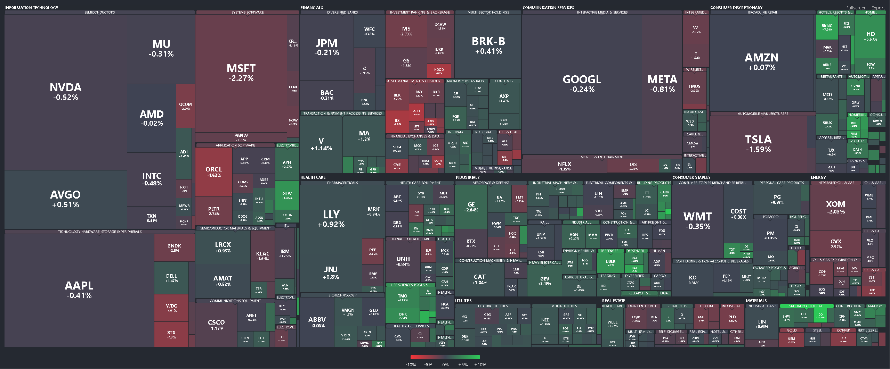
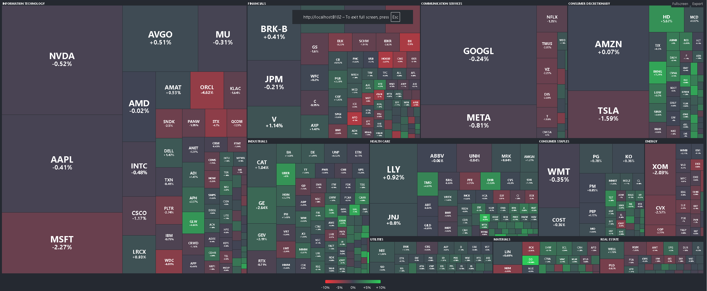
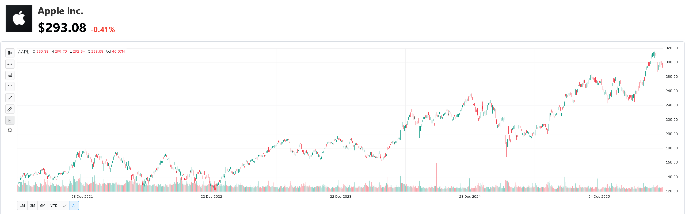
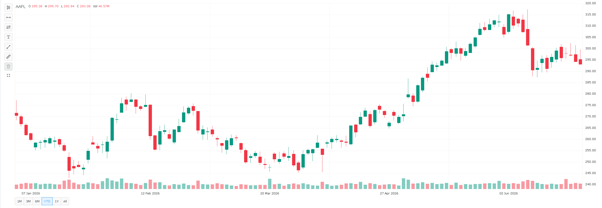

## (A) Python - Data preparation

#### 1. Go to python folder and run the following command in git bash terminal:
```
source docker_env_setup.sh
```
It will generate a virtual environment for Python with libraries specified in requirements.txt installed

#### 2. Edit the details in the .env file
The details are mainly for the PostgreSQL database, including the name, password, port number and the table names for the heatmap app

Also, open a finnhub account (free tier) and put your finnhub API key in the .env file

#### 3. Run the Python code in main.ipynb
Open main.ipynb, press Run All

The following database tables will be produced:
- **spx_stocks:** stock symbol, name, sector and industry
- **spx_profile:** stock profile information
- **spx_chart:** candlestick chart data 
- **spx_growth:** stock growth data (percentage change from yesterday) derived from spx_chart table
- **spx_profile:** stock current market capitalization
- **spx_heatmap:** stock heatmap table derived from the 4 tables above

## (B) Installation
Install **Docker** and **PostgreSQL** to run the App  

## (C) SpringBoot & React
#### 1. With Docker desktop open, run the App in Docker containers
```
source docker_env_setup.sh
```
The names of the images and containers, and the port numbers can be adjusted in docker-compose.yml

#### 2. Docker images & containers
- **stock-data-app:** a SpringBoot app that retrieves data from the database (data stored in part A with Python), and transforms the backend data and provides API links for frontend use 
- **heatmap-ui-app:** a SpringBoot app that receives frontend data provided by stock-data-app, the uses Thymeleaf for frontend to display stock heatmap
- **react-app:** a React frontend app for displaying candlestick chart for individual stocks

## (D) Run the App
Open the following link in your browser to run the stock heatmap app
```
http://localhost:8102/
```

Stock heatmap grouped by Sector and Industry


Switch to group by Sectors only



Clicking on an individual heatmap cell with pop out a new window showing the candlestick chart



Fullscreen mode

